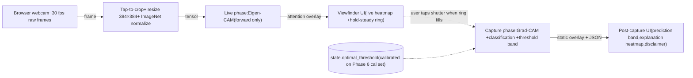

# Realtime screening app — design doc

Follow-up experiment to the binary classifier. Not a product spec.

**Scope change (post-Phase-3).** Earlier drafts of this doc framed the
realtime app as a live continuous-prediction experiment. That framing
required the model to deliver per-frame malignancy probability on phone-
camera input, which has unfixable distribution-shift problems no UX layer
can paper over. This rewrite narrows the live phase to a **framing aid
only** — the live attention overlay helps the user produce a better-framed
capture, and classification only runs on shutter-capture. The two questions
(is the model attending to the lesion? does the model classify correctly?)
are decoupled, with the second one bounded by PAD-UFES-20 eval (Phase 7b)
where it belongs.

## 2a. Research question

> Can a live attention overlay function as a **framing aid** — helping the
> user produce a better-framed capture frame — without requiring the model
> to deliver live diagnostic output? The classification still runs only on
> shutter-capture, where the post-capture frame goes through the full
> pipeline (tap-to-crop, normalize, forward, threshold band). The live
> phase asks one weaker question: is the model attending to the lesion in
> the current viewfinder frame?

**Graceful.** Live heatmap settles on the lesion when the user has framed
the shot reasonably; capture-phase classification then runs on a
dermoscopy-shaped crop. The framing aid has done positive work — the
input distribution at capture time is closer to the training distribution
than it would be without the aid.

**Catastrophic.** Live heatmap wanders randomly even when the lesion is
visibly well-framed, meaning the framing-aid feature is decorative rather
than functional. Either is presentable as a midterm result.

The live heatmap **does NOT predict malignancy.** Attending to the lesion
is necessary-but-not-sufficient for a correct classification on the
captured frame. Distribution shift still bounds classification accuracy;
PAD-UFES-20 eval (Phase 7b) still measures that bound. The framing aid is
orthogonal to that gap, not a way to close it.

## 2b. Deployment target

Browser webcam + Python WebSocket server, served by Gradio's existing UI.
The choice is unchanged from the previous draft; the reasoning shortens.
The live phase now uses Eigen-CAM only (gradient-free, see §2c), so the
streaming requirement is forward-pass-only at ~30 fps. Mobile/desktop
ports don't change the experiment yield — same heatmap localization
quality, same classification accuracy at capture time.

## 2c. CAM choice (rewritten)

The previous design picked full Grad-CAM at every frame as the default.
That was correct for live-diagnosis (the user reads the classification
output, so the heatmap must agree with it). For framing-aid-only, the
choice flips.

| Phase             | CAM variant         | Reason |
|-------------------|---------------------|--------|
| Live viewfinder   | **Eigen-CAM**       | Gradient-free; forward-pass speed (~10ms on the MIG slice at 384×384). Shows the top-SVD component of the last-conv activation tensor — the dominant *variance* direction in the feature representation, which is "what stands out to the model right now." |
| Capture overlay   | **Grad-CAM**        | Class-discriminative direction. Runs once per shutter event; cost is no longer a constraint. Powers the static post-capture explanation — "what drove this prediction." |

The two-CAM design is deliberate: live Eigen-CAM answers "what is the
model looking at?"; static Grad-CAM answers "what drove the
classification?" These are different questions and the slides should
label them as such — see §2g for the disclosure language.

**Why Plain CAM (Zhou 2016) doesn't apply here.** This codebase's head
is `conv → GAP → Dropout → Linear → ReLU → Dropout → Linear` (two linears
with a ReLU between). Plain CAM requires `conv → GAP → Linear`. A
linearized head-CAM is technically possible but is more engineering than
Eigen-CAM and produces a strictly weaker signal. Skip.

**Live-phase latency budget** (Grad-CAM budget is no longer load-bearing
— it runs once per shutter event):

| Stage                                  | Estimate (ms)  | Notes |
|----------------------------------------|----------------|-------|
| Webcam → server frame decode           | 5–15           | Browser-dependent |
| Preprocessing (crop, resize, normalize)| 2–5            | CPU |
| Forward pass + Eigen-CAM (no backward) | 8–12           | A100 MIG 3g.40gb, FP32, batch 1 |
| Heatmap composition + alpha blend      | 5–10           | Could be GPU-side but not needed |
| Server → browser                       | 5–15           | Localhost |
| **End-to-end (live)**                  | **~25–55**     | **~20–40 fps** |

Comfortable inside the 30 fps frame budget. The dual-rate (option 2)
and Plain CAM (option 4) fallbacks from the previous design are no
longer needed; Eigen-CAM at every frame is the only path.

**Validation step before the implementation lands.** Run Eigen-CAM
against `best_model.pth` on a known-lesion test image and visually
confirm the heatmap localizes on the lesion. If it doesn't, the
assumption that "variance direction = what the model is looking at"
breaks for this architecture and the choice needs a revisit. 5-minute
check.

## 2d. Distribution shift

Tap-to-crop remains. The remaining distribution shift (illumination,
sensor, polarization) is still what the experiment measures, BUT the
measurement has moved.

It is no longer "does live prediction degrade gracefully" (which required
live classifications to evaluate). It is **"does live attention localize
on the lesion correctly under phone-camera conditions,"** which only
requires the Eigen-CAM output to evaluate, qualitatively.

The earlier "accept the shift and report the gap as the finding" framing
is struck — it was for live-diagnosis. Updated framing:

> Distribution shift is still bounded by the capture-phase classification,
> which goes through the same model regardless of how the user framed the
> shot. The framing aid reduces *variance* in capture quality, not the
> gap in model performance under shift. The PAD-UFES-20 eval (Phase 7b)
> still measures that gap; nothing in this design changes that
> measurement.

## 2e. UX

Three constraints are unchanged:

1. **Never show a hard label.** "MALIGNANT" must not appear on screen.
   Use screening-threshold language: "above the screening threshold —
   consider clinical review."
2. **Show distance from threshold, not raw probability.** Horizontal band
   with the threshold marked, indicator showing where the captured frame
   falls. Raw decimal invites over-interpretation.
3. **Always-visible non-diagnostic disclaimer.** Persistent banner, not
   buried in a tab.

These all apply to the **capture-phase output**, not the live heatmap.
The live heatmap renders as a soft alpha overlay (red/yellow gradient on
attention regions) — no probability, no label, just attention.

The temporal smoothing (N=5 frames), hold-steady indicator, and
low-confidence suppression now serve a stronger role: **they gate the
shutter, not just the prediction.** The user cannot capture a blurry or
unstable frame, because both Grad-CAM and classification quality depend
on a stable input. Frame-to-frame pixel diff under threshold → ring fills
→ shutter becomes tappable. The framing aid is now doing positive work
(helping the user produce a usable capture), not just negative work
(preventing diagnostic over-interpretation).

The failure mode the UX prevents — a user reading the capture-phase
probability as a verdict — is unchanged. The fix is the same: never
display a number decodable as a diagnosis.

## 2f. What "results" look like (rewritten — different measurements)

The previous measurement set (fps, probability distribution on N≈20
lesions, qualitative Grad-CAM bucket counts, screenshots) was for
live-diagnosis. The framing-aid version measures different things:

1. **End-to-end live-phase fps on the actual machine.** One number,
   measured live, reported as fps. Validates the §2c latency budget.
2. **Eigen-CAM localization rate on N≈20 self-collected smartphone
   viewfinder frames** of classmates' (presumed-benign) lesions. For
   each frame, classify the live heatmap as one of
   {on the lesion / partially on the lesion / off the lesion}. Report
   per-bucket counts. Direct test of whether the framing aid works
   under phone-camera conditions.
3. **Capture-phase prediction variance across N=5 shots of the same
   lesion** by the same user, **with vs without** the live heatmap
   visible. If the heatmap-guided shots show meaningfully lower
   prediction variance, the framing aid is doing real work. If not,
   it's decorative. Either is presentable.
4. **One or two example screenshots** showing the live viewfinder with
   heatmap, then the post-capture static overlay with the classified
   prediction band.

What this set **doesn't claim**: that capture-phase predictions are
clinically accurate. The PAD-UFES-20 eval still owns that question. The
framing-aid results sit alongside the PAD-UFES-20 results — one measures
input quality (can the user get a good shot?), the other measures output
quality (does the model interpret a good shot correctly?). The slides
should label them as independent measurements, not as parts of a single
end-to-end accuracy story.

## 2g. Open risks (updated)

Carryovers from the previous draft (still apply):

- **Ground-truth missing.** Classmates don't come with dermatologist-
  confirmed labels, so capture-phase recall is unmeasurable on the
  self-collected set.
- **Selection bias on the small N.** ~20 lesions is not a random sample
  of the deployment population.
- **User behaviour overrides UX.** A determined user can read the
  smoothed probability band as a diagnosis no matter how it is presented.
- **Privacy and consent.** Localhost-only deployment handles most of
  this; add an explicit consent checkbox before any image is read.
- **Tap-to-crop hides part of the variable.** A steady-handed user with
  good lighting produces dermatoscopy-adjacent images and the model looks
  more in-distribution than it would be in true ambient use.

Changed/added:

> **Live heatmap correctness vs classification correctness are
> orthogonal.** A live heatmap that perfectly localizes on the lesion does
> NOT imply the capture-phase classification will be accurate. The
> framing aid can be doing its job while the model is still confidently
> miscalibrated on phone-camera input. Slide language must not conflate
> these two. The Eigen-CAM localization result (§2f #2) and the
> PAD-UFES-20 AUC result (Phase 7b) are independent measurements and
> should be reported as such.

> **Eigen-CAM's variance direction may not match user intuition about
> "what the model sees."** Variance ≠ discriminative. The 5-minute
> validation check (§2c) against a known-lesion test image catches the
> obvious failure case, but more subtle mismatches between "what the
> model is paying attention to" (live) and "what's driving the
> classification" (capture-phase Grad-CAM) are inherent to using two
> different CAM variants in the same UI. Disclose this on the slide if
> a classmate asks why the live and post-capture heatmaps look different.

**Struck.** The previous draft's "everything below 0.10 looks like
success but could be collapse to benign prior" risk was for the
live-diagnosis probability histogram, which is no longer in the
measurement set. The analogous risk for the framing-aid version
(Eigen-CAM looks reasonable on training-distribution data but wanders on
phone input) is handled by running the validation check (§2c) against
a known-lesion test image AND against a classmate viewfinder frame,
both before implementation finishes.
